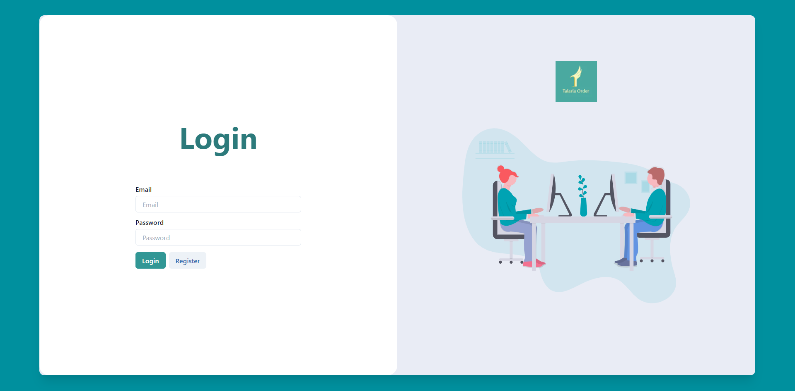
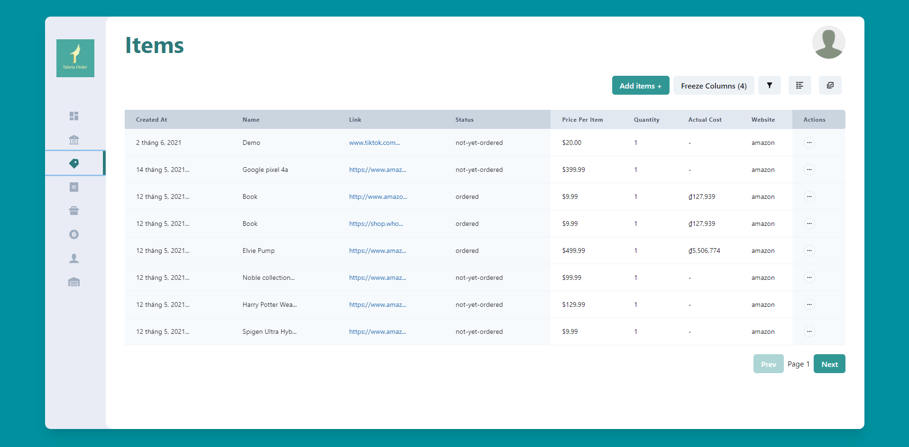
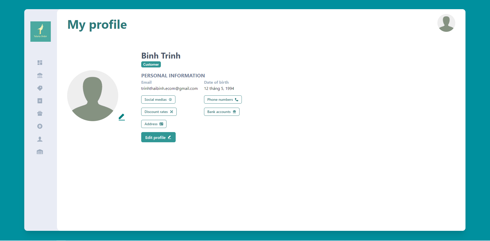
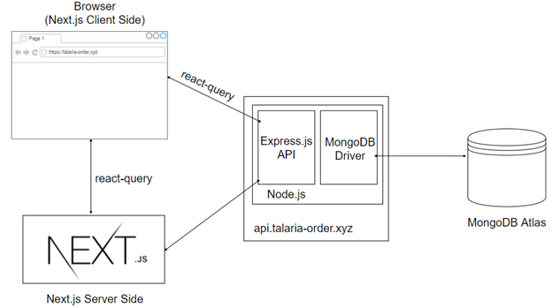

## Front-end code for the Talaria Order Management System

The front-end code written for the Talaria Order Management Symtem that helps increase the company's productivity by providing features such as inventory management, customer relationship management.

## Project Status

This project is currently under development.
Features implemented:

- Developed a blazing fast web application by combining the interactive user interface with server-side rendering using Next.js
- Designed a user friendly user interface with Chakra UI
- Implemented sorts, filters, field selection, pagination, column freezing for data tables.
- Fetched, catched, updated and deleted data using React Query

Features in progress:

- Forgot password screen
- Responsive
- User categories: Each catagory of users should have their own previleges

## Project Screen Shot(s)

## Installation and Setup Instructions

Clone down this repository. You will need `node` and `npm` installed globally on your machine.

Installation:

`npm install`

To Start Server:

`npm start`

To Test API:

`localhost:4444/api/v1/*`

Eg: `GET localhost:4444/api/v1/items`: return all items

## Overall architecture

The tech stack used for this application is the **MERN** (MongoDB, Express.js, React.js, Node.js) stack.
The primary reason why I chose it was that it was the stack that _I have the most experience with_.
Another reason was that _this stack had a vast community that supported it_, so if there was anything that I
needed help with, I could quickly find the answer on Google. However, after the project's halfway point,
I realized that choosing _this tech stack might not be the best decision for this specific application_.
I will talk about my reasons in later sections.

On top of that, I used **Typescript over Javascript** to avoid run-time errors before deploying for the end-users
to see by having a strongly typed system. Essentially, Typescript compiles the code before deploying, and if there
are any type-related errors, the build will fail, and I would not be able to deploy the code. Taking advantage of
the strongly typed system of Typescript helped me avoid showing awkward run-time errors to end-users. The back-end
application was **hosted using a VPS (virtual private server) by AWS** (Amazon web service) called EC2. At the same time,
I **deployed the front-end part to Vercel**, a popular hosting platform for front-end applications.

Now, it is time to talk about the overall architecture of the system. For the front-end part, I used a **React.js Framework called Next.js**
to take advantage of _client-side rendering_ of React.js while still having _server-side rendering_ provided by the
Next.js framework. This setup has a significant advantage on performance because of the
mix and match between client-side rendering and server-side rendering. If in a traditional website, each time the
user interacts with the server through the website, the information is sent to the server, then the server sends a
pre-rendered HTML web page back. It is an inefficient operation since you do not always want to re-render the whole
page. Sometimes you only wish some specific parts to be re-rendered. Next.js was born to solve this slow procedure.
With Next.js, the HTML web page is only sent on the initial page load. After that, any information exchange between
the client and the server will be taken care of by React.js on the client-side, and it is not necessary to send back
and forth the whole HTML page anymore.

In addition to taking advantage of the performance boost provided by Next.js, on the client-side,
I also used a React.js library called **react-query** to cache the data received from the server.
A basic front-end application that does not have cache has to make an API request to the server every time it needs
any data. For example, let's imagine visiting a movie database website like imdb.com, and you want to search for
a movie called "Star Wars: Episode IV – A New Hope." ("Star Wars: Episode IV - A New Hope (1977) - IMDb", 2021).
You click on the "search" button on the search bar, and you get the result page with details about the movie.
After reading through the web page, you decide to read about "Star Wars: The Force Awakens" ("Star Wars: Episode
VII - The Force Awakens (2015) - IMDb", 2021). So, you repeat what you just did, and you receive the detail page of
the new query. Then you want to re-read the information of "Star Wars: Episode IV – A New Hope" because it is the
best movie of the franchise. At this time, you must input the query and hit "search" again. For the three times,
the client has to ask the server and receive new data those three times, including the same searching term.
This is such an inefficient procedure, and it prompts the need for a cache to store the result of the first query
on the client-side. On the third search time, since the data has already been fetched, the browser can go ahead and
read from the cache without making a new request to the server and receiving "old" data. Talaria Order system
takes advantage of this caching concept with the use of react-query. Usually, implementing cache is incredibly
difficult because of the cache validation steps. Fortunately, react-query makes it extremely easy to implement.
All I needed to do was give react-query the keys, such as "Star Wars: Episode IV – A New Hope" for the example
above and the mean to make an API request, react-query handled everything else on its own and made the development process super comfortable.

With Next.js, **data can come from two sources**. The server-side of Next.js can make an API request to the database
server and return the web page with data included to the user's browser. Another source is from the user's browser
making a direct API request to get specific data. For both these means of getting data, there is a Node.js server
running on https://api.talaria-order.xyz . This server runs using **Express.js** to expose _RESTful APIs_ to the client-side.
A MongoDB driver called Mongoose is used on the server to allow the server to interact with a MongoDB instance
hosted on MongoDB Atlas. According to this setup, when the client makes a request to the server, the server makes a
query to the database on different hosting. This setup helps to balance the load for the server. The server now only
has to handle API requests and returns data without taking care of the database.

## Reflection

### Context:

This was the front-end part of a full-stack application that took 4 months to complete for my Master Degree's final project class. The project goal was to help Talaria Order Management Team easily manage their productvity and work flow among the team members.

### Challenges

The first challenge that I met with this project was **authentication**. It took me a while to figure out how `authentication flow` and how `server-side rendering` works with `Next.js`. As I read the documentation, there were several options for me to choose from. I tried them, but none of them felt natural to me, thus I decided to implement my own authentication flow based on the documentation. Fortunately, it worked nicely in the end.

The second challenge was the **web deployment process**. Because it has both front-end and back-end parts, I had to
_deploy them to two separate places_ for performance purposes, and it caused a couple of problems for me. First of all,
the _CORS (Cross-Origin Resource Sharing) policy_ prevented my front-end from making calls to the back-end because they
did not come from the same server. The second issue was that I used _cookies for authentication_, and having back-end
and front-end coming from different URLs made it impossible to implement authentication. After researching the topic,
I understood that having a shared domain would solve both issues. And then, I proceeded with buying a custom domain
just for the front-end part and back-end to talk with one another. Fortunately, it solved both issues.

The third challenge was **time management**. I did not have a specific plan at the beginning to work on the project.
I was trying to work on it whenever I could, and I did not have any enforcement on the progress. It was such a bad
idea until I realized that I had not finished the back-end part in the latter half of the timeline. After that,
I tried to commit twenty-five hours per week and set specific goals for each week, and it helped me finish the
application right before the deadline. However, I did not have enough time to do testing. This taught me to have a
better time management plan for future projects.

### Mistakes/failures/What I'd do differently

One of the major mistakes I made with this project was that I **did not deploy the application until the last phase**.
When I deployed the project, it _did not work for the authentication and API call_. I lost so much time figuring out
the problem and finding the solution. Since this was the biggest project I have ever built, I was afraid that
I would need to change the code in many places that I was not aware of. It turned out alright in the end, but that
was a big mistake, and it taught me that I should test deployment earlier in the process. I also learned about why
my deployment failed, and I would use those pieces of knowledge for my future projects.

Another mistake was that I **did not have a clear goal about the functionalities** included. In the four-month time,
I planned to integrate too many features into the system that made it impossible to do. I later learned that
I should build the minimum viable product first before adding more complicated features.

The last mistake that I would like to mention was that I **did not consider the stakeholder's and the primary user's
opinion** before building the project. When I showed the application to my friends, who are the primary users,
they suggested some changes that I agreed with and later implemented. The problem was that if I included them from
the beginning, I would not have to waste time writing codes that were born to be disposed of. It was such a waste of
time doing all the work. This teaches me a lesson to consider the main user's opinions more in the future.
